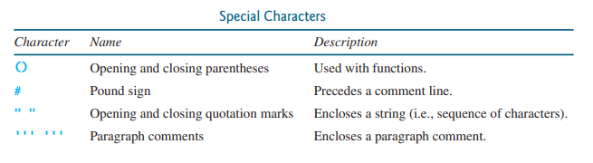

## Welcome
So, let’s get started with Python on this Replit IDE (Integrated Developer Environment) by writing a simple program that displays the messages `Welcome to Python on Replit` and `This is where things start to get very interesting, Python is fun` and lastly `There is so much that can be done with it` on the console.    
The word **_console_** is an old computer term that refers to the text entry and display device of a computer. Console input means to receive input from the keyboard and console output means to display output to the monitor. 

>**A Python program is executed from the Python interpreter.**
___
The symbol **>>>** or  (the command-line interface with the blinking cursor) is the **_Python statement prompt_**, and it is where you can enter a Python **_statement_**. 

So, what is a statement? A **_statement_** is simply a section of code that represents a command or action. Each statement specifies a task to perform. For example: 

In the code snippet shown above, line 1 is called a **_variable assignment statement_**, because it assigns the value of “tobi” to a variable called `name`. Line 2 is a **_function call statement_**, it calls the `print` function and displays an output on the console. We will discuss more about all these concepts as we explore further. 

Please type the following commands exactly as they are written in this text. 

In the console window, right at the prompt with the blinking cursor, type `print(“Welcome to Python on Replit”)` and press the _Enter_ key. The string `Welcome to Python on Replit` should appear on the console. **_String_** is a programming term meaning a sequence of zero or more characters, you probably know this already but there is nothing wrong in emphasizing it. A **_String_** basically represent text values. 

Next, at the console input area, type `print(“This is where things start to get very interesting, Python is fun”)` and press *Enter*. Lastly type `print(“There is so much that can be done with it”)` and also press *Enter*. 

---

*Note that Python requires double or single quotation marks around strings to mark them out from other code.* 

--- 
The print statement is one of Python’s built-in functions that can be used to display a string on the console. A function performs actions. In the case of the print function, it displays a message to the console. 

---
*In programming terminology, when you use a function, you are said to be “invoking a function” or “calling a function.”* 

---
You can add additional statements at the statement prompt. For instance, typing `30 + 6` should output `36`. 

## Creating Python Source Code Files

Entering Python statements at the statement prompt is convenient, but the statements are not saved. To save statements for later use, you can create a text file to store the statements. 

A text file named `main.py` is already available for you by default. By convention, Python files are named with the extension **.py**. 

This `main.py` file is called the source file or script file, or module (more on this later). Running a Python program from a script file is known as running Python in *script mode*. Typing a statement at the statement prompt and executing it is called running Python in *interactive mode*. 

Now, let's run our program in script mode. In the Python script (the `main.py` file), type the three print statements you earlier typed in the statement prompt in interactive mode. Hit the *Run* button above to see the output at the console. Once again, note that the print statement is one of Python’s built-in functions that can be used to display a string on the console.    
Another built-in function is `type(value)`, which returns the data type of the value or variable that the function has been provided. For example, type `type(4)` at the statement prompt in interactive mode and you should see  **<class 'int'>** displayed on the console, **'int'** stands for integer, which means whole numbers. Now, type `type(“coding”)` also and you should see **<class 'str'>** displayed on the console, don't worry about the **class** part for now, but **'str'** stands for string or text. 

Additionally, note that Python programs are case sensitive. It would be wrong, for example, to replace `print` in the program with `Print`. Try it and see what happens. 

You have seen several special characters _(#, ", ())_ in the program. They are used in almost every program. The table below summarizes their uses: 

## Performing Mathematical Computations with Python

Python programs can perform all sorts of mathematical computations and display the result, from addition to subtraction, multiplication and division. 

To show an example of a program that evaluates and prints its result. Type `print((10.5 + 2 * 3) / (45 – 3.5))` in your **main.py** file and run it. 

As you can see, it is a straightforward process to translate an arithmetic expression to a Python expression. We will discuss Python expressions further as we proceed and perform more complex mathematical operations, but for now, this is just an intro. :smile: 

### Do the following:
---
- [ ] **Task 1**

Write a program that displays the result of 

- [ ] **Task 2**

Write a program that displays the area and perimeter of a rectangle with the width of 4.5 and height of 7.9 using the following formula: *area = width \* height* 

- [ ] **Task 3**
      
Assume a runner runs 16 kilometers in 45 minutes and 30 seconds. Write a program that displays the average speed in miles per hour. (Note that 1 mile is 1.6 kilometers.) 

- [ ] **Task 4**

Assume that a runner runs 24 miles in 1 hour, 40 minutes, and 35 seconds. Write a program that displays the average speed in kilometers per hour. (Note 1 mile is equal to 1.6 kilometers.) 

When you done, click the **Submit** button, located at the top right area of your screen.    
:+1:

